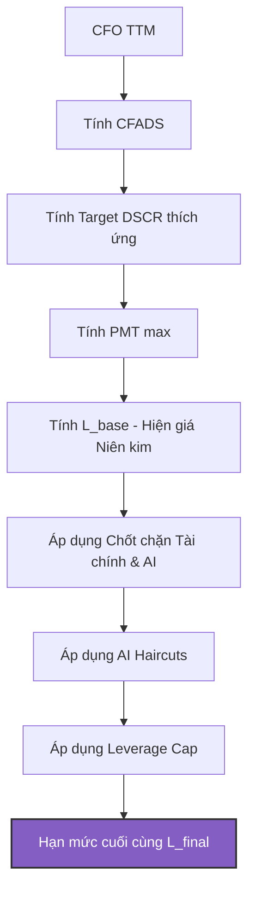

# HƯỚNG DẪN CHUYÊN SÂU: THẨM ĐỊNH HẠN MỨC TÍN DỤNG & ĐÁNH GIÁ RỦI RO
### *Credit Limit Underwriting & Rating Assessment Framework*

> **Phiên bản:** 2.0 (cập nhật 2026-05-21) | Xem tổng quan đầy đủ: [tong_quan_he_thong_va_dinh_muc_tin_dung.md](file:///f:/mo_hinh_danh_gia_pha_san/phan_tich_pha_san_clone/docs/tong_quan_he_thong_va_dinh_muc_tin_dung.md)

---

## I. GIỚI THIỆU & TRIẾT LÝ THIẾT KẾ

Trong hoạt động tài chính doanh nghiệp và quản trị rủi ro ngân hàng, việc xác định **Hạn mức Tín dụng vay vốn** thường phụ thuộc nặng nề vào tài sản thế chấp (Collateral-based) và các chỉ số kế toán tĩnh. Tuy nhiên, cách tiếp cận này bộc lộ những lỗ hổng lớn trong các giai đoạn thị trường biến động (như bất động sản đóng băng hoặc bán lẻ suy thoái) khi tài sản thế chấp bị mất thanh khoản, còn lợi nhuận kế toán bị bóp méo bởi các thủ thuật ghi nhận doanh thu ảo.

Mô hình **Định mức Tín dụng (Credit Sizing - `CreditUnderwriter`)** được xây dựng nhằm giải quyết triệt để vấn đề này thông qua triết lý **Thẩm định dựa trên Dòng tiền thực tế (Cash Flow-based Underwriting)** kết hợp **Trí tuệ nhân tạo (AI-driven Risk Adjustment)**.

### Mục tiêu của mô hình:
1. **Underwriting Dòng tiền:** Xác định hạn mức tối đa dựa trên dòng tiền hoạt động kinh doanh thực tế chứ không dựa trên lợi nhuận kế toán (P&L).
2. **Thích ứng Rủi ro Động (Dynamic Risk-Pricing):** Tự động điều chỉnh biên an toàn (DSCR) dựa trên cả sức khỏe tài chính tĩnh và rủi ro phá sản động dự báo bởi AI.
3. **Cơ chế Bảo vệ Kép (Double-layer Protection):** Kết hợp các chốt chặn dòng tiền truyền thống (ICR, CFO, Equity) và chốt chặn AI (XGBoost PD, Risk Level) để tránh các khoản vay "xác sống" (Zombie loans).

---

## II. KHUNG TOÁN HỌC & LOGIC ĐỊNH MỨC

Mô hình định mức tín dụng hoạt động tuần tự qua các bước tính toán toán học nghiêm ngặt:



### 1. Dòng tiền Khả dụng Trả nợ (CFADS - Cash Flow Available for Debt Service)
Điểm khởi đầu của hạn mức là dòng tiền từ hoạt động kinh doanh lũy kế 4 quý gần nhất ($CFO_{TTM}$), loại bỏ các khoản thu/chi tài chính phi cốt lõi:
$$CFADS = \max(CFO_{TTM}, 0.0)$$

> [!CAUTION]
> Nếu $CFADS \le 0$ (doanh nghiệp bị âm dòng tiền hoạt động kinh doanh), hạn mức tín dụng lập tức bị cưỡng chế về $0$. Hệ thống không cấp tín dụng mới cho doanh nghiệp không tự tạo ra tiền từ lõi vận hành.

### 2. Hệ số DSCR Mục tiêu Thích ứng (Dynamic Target DSCR)
Thông thường, các tổ chức tín dụng áp dụng một hệ số DSCR tĩnh (ví dụ: $1.20x$). Hệ thống này phá vỡ tư duy đó bằng cách tự động áp thuế rủi ro (risk penalty) lên DSCR dựa trên các vùng rủi ro:

$$DSCR_{target} = DSCR_{base} + \Delta DSCR_{Inventory} + \Delta DSCR_{Capital} + \Delta DSCR_{WorkingCapital} + \Delta DSCR_{AI}$$

Trong đó:
*   **$DSCR_{base}$ (Hệ số nền):** Được cố định ở mức $1.20x$.
*   **$\Delta DSCR_{Inventory}$ (Phạt ứ đọng tồn kho):** Nếu tỷ lệ Hàng tồn kho / Tổng tài sản ($Inventory/TA$) $> 40\%$, cộng thêm **$0.30$**. (Rất quan trọng trong BĐS khi tồn kho là các dự án bị kẹt pháp lý).
*   **$\Delta DSCR_{Capital}$ (Phạt đòn bẩy cao):** Nếu tỷ lệ Vốn chủ sở hữu / Tổng Nợ ($Equity/Debt$) $< 0.30$, cộng thêm **$0.30$**.
*   **$\Delta DSCR_{WorkingCapital}$ (Phạt thâm hụt thanh khoản ngắn hạn):** Nếu Vốn lưu động ròng âm ($Working\ Capital / TA < 0$), cộng thêm **$0.20$**.
*   **$\Delta DSCR_{AI}$ (Bù đắp rủi ro AI):** Tăng tuyến tính theo xác suất vỡ nợ dự báo bởi XGBoost:
    $$\Delta DSCR_{AI} = \frac{PD_{XGBoost}}{100}$$

*Ví dụ:* Một doanh nghiệp có $PD_{XGBoost} = 35\%$ sẽ bị tăng DSCR thêm $0.35x$.

### 3. Số tiền Trả nợ Hàng năm Tối đa (PMT_max)
Dựa trên dòng tiền khả dụng và hệ số an toàn thích ứng vừa tính, số tiền gốc và lãi tối đa doanh nghiệp được phép trả mỗi năm là:
$$PMT_{max} = \frac{CFADS}{DSCR_{target}}$$

### 4. Hạn mức Cơ sở ($L_{base}$) - Công thức Niên kim (Annuity Formula)
Để quy đổi dòng trả nợ hàng năm thành tổng quy mô khoản vay gốc ($L_{base}$), hệ thống áp dụng công thức hiện giá của niên kim đều (PV of Annuity) với lãi suất cho vay giả định ($r$) và kỳ hạn vay ($n$):

$$L_{base} = PMT_{max} \times \left[ \frac{1 - (1 + r)^{-n}}{r} \right]$$

---

## III. CHỐT CHẶN RỦI RO & CHIẾT KHẤU TÍN DỤNG

Sau khi xác định hạn mức cơ sở $L_{base}$, hệ thống thực hiện quét qua các chốt chặn an toàn tài chính và rủi ro AI để điều chỉnh ra hạn mức khả thi cuối cùng $L_{final}$.

### 1. Hệ thống Chốt chặn Cưỡng chế (Circuit Breakers)
Hệ thống sẽ lập tức từ chối cho vay ($L_{final} = 0$) nếu vi phạm một trong các điều kiện ngắt mạch sau:

| Loại Chốt chặn | Điều kiện ngắt mạch | Lý do tài chính / AI |
| :--- | :--- | :--- |
| **AI Circuit Breaker** | $PD_{XGBoost} > 55.0\%$ hoặc $Risk\ Level \ge 4$ (Danger/Critical) | Rủi ro phá sản vượt quá ngưỡng kiểm soát của tổ chức tín dụng. |
| **ICR Breaker** | $Interest\ Coverage\ Ratio (ICR) < 1.0$ | Lợi nhuận không đủ trả lãi vay hiện tại, không thể gánh thêm nợ mới. |
| **Vốn chủ sở hữu âm** | $Equity \le 0$ | Tình trạng mất vốn, doanh nghiệp đã phá sản về mặt kỹ thuật. |
| **Dòng tiền âm** | $CFADS \le 0$ | Không có thặng dư tiền mặt từ lõi vận hành để trả nợ. |

### 2. Chiết khấu Rủi ro AI (AI Haircuts)
Đối với các doanh nghiệp chưa rơi vào diện từ chối nhưng nằm trong vùng giám sát rủi ro, hạn mức sẽ bị chiết khấu trực tiếp để bảo vệ nguồn vốn:
*   **Nhóm Cảnh báo (Watch - Risk Level 2):** Chiết khấu $15\%$ hạn mức vay.
    $$L_{final} = L_{base} \times 0.85$$
*   **Nhóm Căng thẳng (Stress - Risk Level 3):** Chiết khấu $40\%$ hạn mức vay.
    $$L_{final} = L_{base} \times 0.60$$

### 3. Chốt chặn Đòn bẩy Bảng Cân đối (Balance Sheet Leverage Cap)
Đây là chốt chặn cuối cùng nhằm kiểm soát cấu trúc tài chính sau khi giải ngân. Để đảm bảo doanh nghiệp duy trì một tấm đệm vốn tự có an toàn tối thiểu là **$15\%$** trên tổng quy mô nợ phải trả sau khi nhận thêm khoản vay mới ($L_{final}$):

$$\frac{Equity}{Total\ Debt + L_{final}} \ge 0.15$$

Giải phương trình tìm giới hạn trên của $L_{final}$:

$$Total\ Debt + L_{final} \le \frac{Equity}{0.15}$$
$$L_{final} \le \left( \frac{Equity}{0.15} \right) - Total\ Debt$$

Do đó, giới hạn đòn bẩy tối đa đối với dư nợ mới được xác định là:
$$Leverage\ Cap = \max\left( 0.0, \frac{Equity}{0.15} - Total\ Debt \right)$$

> [!IMPORTANT]
> Nếu hạn mức sau khi qua các bộ lọc dòng tiền và AI ($L_{final}$) vẫn lớn hơn $Leverage\ Cap$, hệ thống sẽ cưỡng chế cắt giảm hạn mức về đúng bằng $Leverage\ Cap$ và đưa ra cảnh báo: *"Chốt chặn đòn bẩy: Giới hạn dư nợ mới không vượt quá..."*

---

## IV. ĐẶC TẢ MÃ NGUỒN CỐT LÕI

Thuật toán được hiện thực hóa trong tệp tin [credit_model.py](file:///f:/mo_hinh_danh_gia_pha_san/phan_tich_pha_san_clone/src/credit_model.py) thông qua lớp `CreditUnderwriter`. Dưới đây là logic cốt lõi của hàm tính toán:

```python
def calculate_capacity(self, cfo_ttm: float, icr: float, inventory_ta: float, 
                       equity_debt: float, wc_ta: float, equity: float, 
                       total_debt: float, rate: float, tenor: int,
                       pd_xgboost: float = 0.0, risk_level: int = 1, 
                       composite_score: float = 0.0) -> dict:
    # 1. CFADS
    cfads = cfo_ttm if not np.isnan(cfo_ttm) and cfo_ttm > 0 else 0.0

    # 2. Target DSCR adjustments
    target_dscr = self.base_target_dscr
    if not np.isnan(inventory_ta) and inventory_ta > 0.40:
        target_dscr += 0.3
    if not np.isnan(equity_debt) and equity_debt < 0.3:
        target_dscr += 0.3
    if not np.isnan(wc_ta) and wc_ta < 0:
        target_dscr += 0.2
        
    # AI Penalty: Tăng DSCR tuyến tính dựa trên XGBoost PD%
    if not np.isnan(pd_xgboost) and pd_xgboost > 0:
        target_dscr += (pd_xgboost / 100.0)

    # 3. PMT max
    pmt_max = cfads / target_dscr if target_dscr > 0 else 0.0

    # 4. L base (PV of Annuity)
    if rate > 0 and tenor > 0:
        pv_factor = (1 - (1 + rate) ** (-tenor)) / rate
        l_base = pmt_max * pv_factor
    else:
        l_base = 0.0

    # 5. Circuit Breakers (Chốt chặn)
    l_final = l_base
    status = "Khả thi"
    warnings = []
    ai_impact = "Không"

    # AI Circuit Breaker (Ngưỡng tử thần)
    if pd_xgboost > 55.0 or risk_level >= 4:
        l_final = 0.0
        status = "Từ chối"
        warnings.append(f"AI Circuit Breaker: Từ chối do rủi ro phá sản nghiêm trọng.")
        ai_impact = "Từ chối hoàn toàn"

    # Chặn ICR
    if not np.isnan(icr) and icr < 1.0 and status != "Từ chối":
        l_final = 0.0
        status = "Từ chối"
        warnings.append("Khả năng trả lãi (ICR) < 1.0: Không đủ khả năng thanh toán nợ hiện tại.")

    # AI Haircut (Chiết khấu hạn mức)
    if status != "Từ chối":
        if risk_level == 3: # Stress
            l_final *= 0.60
            status = "Cắt giảm (AI Haircut 40%)"
            ai_impact = "-40%"
        elif risk_level == 2: # Watch
            l_final *= 0.85
            status = "Cắt giảm (AI Haircut 15%)"
            ai_impact = "-15%"

    # Chặn Đòn bẩy
    if equity > 0 and total_debt >= 0 and status != "Từ chối":
        leverage_cap = (equity / self.min_leverage_ratio) - total_debt
        leverage_cap = max(0.0, leverage_cap)
        if l_final > leverage_cap:
            l_final = leverage_cap
            status = "Cắt giảm (Haircut Đòn bẩy)"
            warnings.append(f"Chốt chặn đòn bẩy: Giới hạn dư nợ mới không vượt quá {leverage_cap/1e9:,.1f} Tỷ VND.")
            
    # Trả về kết quả chi tiết...
```

---

## V. HƯỚNG DẪN VẬN HÀNH TRÊN GIAO DIỆN

Giao diện thẩm định hạn mức được tích hợp trực quan tại **Tab 7: Định mức Tín dụng** trên Streamlit Dashboard (`src/app.py`).

### 1. Các thông số đầu vào (Giả định Vay vốn)
*   **Chọn doanh nghiệp:** Hộp chọn (selectbox) liệt kê toàn bộ danh sách doanh nghiệp trong danh mục phân tích. Hệ thống tự động truy xuất các chỉ số tài chính thô ($CFO$, $Equity$, $Debt$, $Inventory$, $Working\ Capital$) và các chỉ số rủi ro AI ($PD_{XGBoost}$, $Risk\ Level$) tương ứng với doanh nghiệp đó tại năm gần nhất.
*   **Lãi suất cho vay (%/năm):** Thanh trượt điều chỉnh lãi suất cho vay kỳ vọng (từ $1.0\%$ đến $25.0\%$).
*   **Kỳ hạn vay (Năm):** Thanh trượt điều chỉnh thời gian vay (từ $1$ đến $20$ năm).

### 2. Bộ chỉ số Kết quả (Metrics)
*   **Target DSCR:** Hiển thị hệ số an toàn dòng tiền mục tiêu sau khi đã cộng dồn các khoản phạt rủi ro tài chính và rủi ro AI.
*   **Mức trả nợ tối đa/năm:** Số tiền gốc và lãi lớn nhất doanh nghiệp có thể trả mỗi năm dựa trên dòng tiền cốt lõi.
*   **Hạn mức khả thi ($L_{final}$):** Quy mô khoản vay tối đa khả thi. Hộp chỉ số này tự động đổi màu theo trạng thái:
    *   **Xanh lá:** Khả thi (đáp ứng đầy đủ các điều kiện).
    *   **Cam:** Cắt giảm (bị giảm trừ bởi AI Haircut hoặc Chốt chặn đòn bẩy).
    *   **Đỏ:** Từ chối (Hạn mức bằng $0$ do vi phạm chốt chặn).

### 3. Phân tích Độ nhạy Lãi suất
Bên dưới kết quả, hệ thống vẽ một biểu đồ đường động (**📈 Phân tích độ nhạy**) thể hiện biến thiên của hạn mức tín dụng vay vốn khả thi tối đa ($L_{final}$) khi lãi suất vay dịch chuyển trong biên độ $\pm 10\%$ quanh mức lãi suất được chọn. Đường đứt nét màu đỏ đánh dấu mức lãi suất hiện tại, giúp thẩm định viên nhanh chóng đánh giá kịch bản stress-test lãi suất thị trường tăng cao.

---
*Tài liệu hướng dẫn vận hành và phân tích cấu trúc của module Credit Sizing thuộc hệ thống dự báo rủi ro phá sản.*
