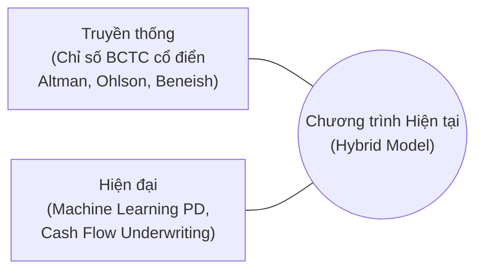

# ĐỊNH VỊ CHƯƠNG TRÌNH TRONG BỨC TRANH TOÀN CẢNH

> **Phạm vi:** Đánh giá vị thế công nghệ của Chương trình Đánh giá Rủi ro Phá sản hiện tại so với xu hướng công nghệ xếp hạng tín dụng toàn cầu.  
> **Tài liệu tham chiếu:** [Thế giới hiện đã có những dữ liệu và hệ thống xếp hạng...](file:///f:/mo_hinh_danh_gia_pha_san/phan_tich_pha_san_clone/docs/th%E1%BA%BF%20gi%E1%BB%9Bi%20hi%E1%BB%87n%20%C4%91%C3%A3%20c%C3%B3%20nh%E1%BB%AFng%20d%E1%BB%AF%20li%E1%BB%87u%20v%C3%A0%20h%E1%BB%87%20th%E1%BB%91ng%20x%E1%BA%BFp....md) và [Tổng quan hệ thống & Hướng dẫn hạn mức tín dụng](file:///f:/mo_hinh_danh_gia_pha_san/phan_tich_pha_san_clone/docs/tong_quan_he_thong_va_dinh_muc_tin_dung.md).

---

## 1. Định vị tổng quát
Chương trình hiện tại đóng vai trò là một **mô hình lai (Hybrid System)** giao thoa giữa phương pháp phân tích tài chính doanh nghiệp truyền thống và triết lý thẩm định dòng tiền kết hợp AI hiện đại. Chương trình được thiết kế tối ưu và thực tế cho bối cảnh phân tích rủi ro doanh nghiệp (đặc biệt là ngành Bất động sản và Bán lẻ) tại thị trường Việt Nam.

---

## 2. Phân tích chi tiết theo các khía cạnh công nghệ

### 2.1 Nguồn dữ liệu đầu vào (Input Data)
* **Xu thế thế giới:** Dịch chuyển mạnh mẽ sang Open Banking API thời gian thực (Plaid, Yodlee) để quét sao kê tài khoản ngân hàng, SDK hành vi người dùng (Credolab), hoặc dữ liệu POS/SaaS thời gian thực.
* **Chương trình hiện tại:** 
  * Vẫn sử dụng dữ liệu truyền thống là **Báo cáo tài chính (BCTC) Quý/Năm dưới dạng Excel**.
  * **Điểm hiện đại:** Đi sâu vào phân tích và chiết xuất **Dòng tiền hoạt động kinh doanh thực tế (CFO TTM, CFADS)** qua module [cash_flow_scorer.py](file:///f:/mo_hinh_danh_gia_pha_san/phan_tich_pha_san_clone/src/cash_flow_scorer.py). Đây là bước tiệm cận với triết lý *Cash Flow Underwriting* (thẩm định dòng tiền) của thế giới nhưng áp dụng cho dữ liệu báo cáo chuẩn hóa thay vì dòng giao dịch thô.

### 2.2 Công nghệ và thuật toán lõi (Core Modeling)
* **Xu thế thế giới:** Chuyển dịch từ scorecard logistic tĩnh sang Machine Learning phi tuyến tính xử lý hàng nghìn biến số và tự động học (Upstart, Zest AI).
* **Chương trình hiện tại:** Đang nằm ở vị trí **Hybrid (Lai)**:
  * **Trụ cột truyền thống:** Tính toán các chỉ số rủi ro tài chính kinh điển như Altman Z-score, Ohlson O-score, Zmijewski, Beneish M-score (phát hiện gian lận), và Sloan Accruals (phát hiện lợi nhuận ảo).
  * **Trụ cột hiện đại:** Sử dụng Machine Learning hiện đại (**XGBoost** trong [model_engine.py](file:///f:/mo_hinh_danh_gia_pha_san/phan_tich_pha_san_clone/src/model_engine.py)) để tính xác suất phá sản ($PD$), kết hợp với phương pháp hiệu chuẩn thẻ điểm bằng **WOE Bayesian Smoothing & Logistic Regression Calibration** (trong [backtest_engine.py](file:///f:/mo_hinh_danh_gia_pha_san/phan_tich_pha_san_clone/src/backtest_engine.py)).
  * Tổng hợp hai trụ cột này thành một điểm số tổng hợp **Composite Score** để phân loại thành 5 mức rủi ro kiểm soát bằng Hard Override Rules.

### 2.3 Triết lý ra quyết định và cấp hạn mức (Underwriting Philosophy)
* **Xu thế thế giới:** Các BigTech (Stripe, Square) tự động hóa hoàn toàn việc cấp tín dụng nhúng (Embedded Lending) dựa vào vận tốc dòng tiền chảy qua cổng thanh toán của họ.
* **Chương trình hiện tại:** Hoạt động như một **Hệ thống thẩm định và Định mức tín dụng doanh nghiệp (Cash Flow Underwriting Engine)** chuyên nghiệp:
  * Thay vì tư duy tín dụng truyền thống (dựa vào tài sản thế chấp), chương trình định mức dựa trên **dòng tiền khả dụng trả nợ (CFADS)**.
  * Tích hợp các bộ lọc rủi ro hiện đại: **Target DSCR thích ứng** (bị phạt tăng thêm nếu doanh nghiệp bị cảnh báo bởi đòn bẩy, tồn kho hoặc $PD$ từ AI), kết hợp hệ thống lưới an toàn kép **AI Circuit Breakers** (ngắt tín dụng khi rủi ro cao hoặc mất vốn) và **AI Haircuts** (chiết khấu hạn mức theo mức độ rủi ro).

---

## 3. Bản đồ đối chiếu vị thế công nghệ

| Tiêu chí | Hệ thống Truyền thống (FICO, Bureau cổ điển) | Hệ thống Hiện đại (Cash Flow / AI Platforms) | Chương trình hiện tại của bạn |
| :--- | :--- | :--- | :--- |
| **Dữ liệu đầu vào** | Lịch sử tín dụng tĩnh từ Trung tâm thông tin tín dụng (CIC, FICO). | Dòng tiền thời gian thực (Open Banking API), dữ liệu thiết bị/Telco, dữ liệu POS/SaaS. | **BCTC Quý/Năm dạng Excel**. Tập trung sâu vào CFO TTM & cấu trúc tài chính doanh nghiệp. |
| **Bản chất mô hình** | Xếp hạng phân vị rủi ro tổng quát (Rank-ordering). | Xác suất vỡ nợ ngắn hạn cho từng sản phẩm vay cụ thể. | **Lai (Hybrid)**: Điểm rủi ro tổng hợp (Composite Score 1–5) + xác suất phá sản phi tuyến tính ($PD$ XGBoost). |
| **Độ trễ dữ liệu** | Trễ từ 30 – 60 ngày. | Thời gian thực hoặc Cận thời gian thực. | **Cận thời gian thực theo kỳ công bố BCTC** (Trễ từ 30 – 45 ngày theo chu kỳ báo cáo). |
| **Công nghệ lõi** | Hồi quy Logistic tĩnh (Scorecard truyền thống). | Machine Learning / Deep Neural Networks. | **Sự kết hợp**: Các mô hình tài chính kinh điển + Machine Learning (XGBoost, WOE Bayesian Calibration). |
| **Triết lý cấp hạn mức** | Dựa trên tài sản bảo đảm (Collateral) hoặc hạn mức cứng theo quy mô tài sản. | Dựa trên vận tốc dòng tiền thực tế qua cổng thanh toán & hành vi. | **Dựa trên Dòng tiền khả dụng trả nợ (CFADS)** + Target DSCR thích ứng + Chốt chặn an toàn (Circuit Breakers / Haircuts). |

---

## 4. Kết luận
Chương trình hiện tại của bạn là một bước đi **thực tiễn và tối ưu nhất cho bối cảnh doanh nghiệp Việt Nam**. Trong điều kiện Open Banking đối với doanh nghiệp chưa phổ biến và các doanh nghiệp lớn (đặc biệt là BĐS) vẫn vận hành chủ yếu qua các báo cáo tài chính định kỳ, việc xây dựng một hệ thống **thẩm định dòng tiền (Cash Flow Underwriting)** dựa trên BCTC nhưng được bổ trợ mạnh mẽ bằng **Machine Learning (XGBoost)** và các mô hình tài chính kinh điển chính là lời giải tối ưu để vượt qua những hạn chế của phương pháp chấm điểm truyền thống.
