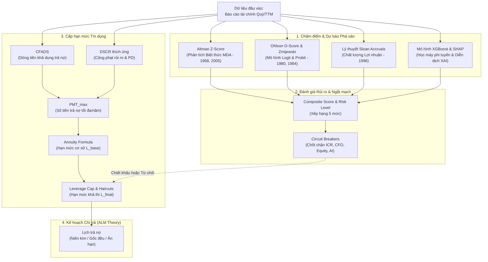

# BỘ KHUNG PHƯƠNG PHÁP LUẬN VÀ NỀN TẢNG KHOA HỌC
### *Theoretical Framework and Scientific Foundations of the System*

Tài liệu này hệ thống hóa toàn bộ khung lý thuyết khoa học, các công bố lý luận kinh điển và mô hình trực quan làm nền tảng cho hệ thống phân tích rủi ro phá sản, chấm điểm tín dụng, cấp hạn mức và lên kế hoạch chi trả.

---

## I. MÔ HÌNH TRỰC QUAN KHÁI QUÁT HỆ THỐNG (SYSTEM OVERVIEW MODEL)

Dưới đây là sơ đồ dòng chảy lý thuyết và logic từ dữ liệu báo cáo tài chính đầu vào đến quyết định hạn mức và lịch trả nợ cuối cùng:

---

## II. KHUNG LÝ THUYẾT CHI TIẾT & CÔNG BỐ KHOA HỌC HỖ TRỢ

### 1. Khung Lý thuyết Chấm điểm Tín dụng và Dự báo Phá sản (Credit Scoring)

#### A. Mô hình Phân tích Biệt thức Đa biến (Multiple Discriminant Analysis - MDA)

*Phát biểu khoa học:* Nhận diện rủi ro kiệt quệ tài chính bằng cách ánh xạ các chỉ số tài chính (Thanh khoản, tích lũy vốn, ROA, đòn bẩy) lên một siêu phẳng tuyến tính tối ưu hóa khoảng cách giữa hai nhóm doanh nghiệp (lành mạnh và phá sản). Mô hình sử dụng **Altman Z''-Score** làm chỉ số nền tảng vì được tinh chỉnh đặc biệt cho các thị trường mới nổi và doanh nghiệp phi sản xuất.

*Phương trình toán học:*
$$Z'' = 3.25 + 6.56 \cdot X_1 + 3.26 \cdot X_2 + 6.72 \cdot X_3 + 1.05 \cdot X_4$$

Trong đó:
*   $X_1 = \frac{\text{Vốn lưu động ròng}}{\text{Tổng tài sản}}$. Đối với BĐS: $X_1 = \frac{(\text{Tài sản ngắn hạn} - \text{Hàng tồn kho}) - \text{Nợ ngắn hạn}}{\text{Tổng tài sản}}$. Đối với Bán lẻ: $X_1 = \frac{\text{Vốn lưu động} + \text{Phải trả người bán ngắn hạn}}{\text{Tổng tài sản}}$.
*   $X_2 = \frac{\text{Lợi nhuận giữ lại}}{\text{Tổng tài sản}}$ (sử dụng Lãi chưa phân phối / LNST chưa phân phối).
*   $X_3 = \frac{\text{EBIT}}{\text{Tổng tài sản}}$.
*   $X_4 = \frac{\text{Vốn chủ sở hữu (giá trị sổ sách)}}{\text{Tổng nợ phải trả}}$.

*Công bố hỗ trợ:*
*   **Altman, E. I. (1968).** *Financial Ratios, Discriminant Analysis and the Prediction of Corporate Bankruptcy.* The Journal of Finance, 23(4), 589-609.
*   **Altman, E. I. (2005).** *An Emerging Market Credit Scoring Model for Corporates: The Z''-Score.* Emerging Markets Review.

#### B. Mô hình Ước lượng Xác suất Phá sản (Probabilistic Prediction Models - Logit & Probit)

*Phát biểu khoa học:* Khắc phục các giả định chặt chẽ của MDA (phân phối chuẩn và đồng phương sai), mô hình hồi quy Logistic (**Ohlson O-Score**) và mô hình hồi quy Probit (**Zmijewski Score**) tính toán xác suất phá sản cụ thể ($PD \in [0, 1]$). Ohlson tối ưu hóa hàm phân phối tích lũy Logistic, trong khi Zmijewski sử dụng hàm tích lũy chuẩn tắc (Gaussian CDF) nhằm hạn chế sai lệch chọn mẫu (sample selection bias).

*Phương trình toán học:*

*   **Ohlson O-Score:**
$$O = -1.32 - 0.407 \cdot \ln(TA / 10^6) + 6.03 \cdot \frac{TL}{TA} - 1.43 \cdot \frac{WC}{TA} + 0.0757 \cdot \frac{CL}{CA} - 1.72 \cdot OENEG - 2.37 \cdot \frac{NI}{TA} - 1.83 \cdot \frac{CFO}{TL} + 0.285 \cdot INTWO - 0.521 \cdot CHIN$$
$$PD_{\text{Ohlson}} = \frac{1}{1 + e^{-O}} \times 100\%$$
*(Với $TA$ là Tổng tài sản, $TL$ là Tổng nợ, $WC$ là Vốn lưu động, $CL$ là Nợ ngắn hạn, $CA$ là Tài sản ngắn hạn, $NI$ là Lợi nhuận thuần, $CFO$ là Dòng tiền HĐKD, $OENEG$ là biến giả $TL > TA$, $INTWO$ là biến giả lợi nhuận âm 2 năm liên tiếp, và $CHIN$ là tỷ lệ biến động lợi nhuận).*

*   **Zmijewski Score:**
$$X = -4.336 - 4.513 \cdot \frac{NI}{TA} + 5.679 \cdot \frac{TL}{TA} - 0.004 \cdot \frac{CA}{CL}$$
$$PD_{\text{Zmijewski}} = \frac{1}{1 + e^{-X}} \times 100\%$$

*Công bố hỗ trợ:*
*   **Ohlson, J. A. (1980).** *Financial Ratios and the Probabilistic Prediction of Bankruptcy.* Journal of Accounting Research, 18(1), 109-131.
*   **Zmijewski, M. E. (1984).** *Methodological Issues Related to the Estimation of Financial Distress Prediction Models.* Journal of Accounting Research, 22, 59-82.

#### C. Lý thuyết Dồn tích và Chất lượng Lợi nhuận (Sloan Accruals Anomaly)

*Phát biểu khoa học:* Lợi nhuận kế toán không đồng nghĩa với khả năng sinh tồn của dòng tiền. Các doanh nghiệp có tỷ lệ dồn tích (Accruals) lớn — sự chênh lệch lớn giữa Lợi nhuận thuần và Dòng tiền hoạt động kinh doanh (CFO) — phản ánh chất lượng lợi nhuận thấp, tính bền vững kém và nguy cơ mất khả năng thanh toán tăng vọt. Trong ngành Bất động sản, chỉ số Sloan Accruals được đè nặng thay thế cho Beneish M-Score để ngăn chặn hiện tượng "doanh thu ảo" từ việc ghi nhận trước tiến độ dự án.

*Phương trình toán học:*
$$\text{Sloan Accruals} = \frac{\text{NI} - \text{CFO}}{\text{Average TA}} \times 100\%$$

Trong đó: $\text{Average TA} = \frac{TA_t + TA_{t-1}}{2}$; $\text{NI}$ là Lợi nhuận sau thuế; $\text{CFO}$ là Dòng tiền thuần từ HĐKD.

*Công bố hỗ trợ:*
*   **Sloan, R. G. (1996).** *Do Stock Prices Fully Reflect Information in Accruals and Cash Flows about Future Earnings?* The Accounting Review, 71(3), 289-315.

#### D. Mô hình Học máy phi tuyến & Trí tuệ nhân tạo giải thích được (XAI)

*Phát biểu khoa học:* Mối quan hệ giữa cấu trúc tài chính và rủi ro phá sản mang tính chất phi tuyến tính và tương tác phức tạp (ví dụ: đòn bẩy cao chỉ kích hoạt phá sản khi đi kèm thâm hụt tiền mặt nghiêm trọng). Hệ thống tích hợp thuật toán phân loại cây tăng cường **XGBoost** để tối ưu hóa hàm mất mát lỗi (Binary Logistic Loss) và sử dụng **Shapley Additive exPlanations (SHAP)** dựa trên lý thuyết trò chơi hợp tác để định lượng chi tiết đóng góp cận biên của từng chỉ số tài chính vào xác suất vỡ nợ.

*Phương trình toán học:*

*   **XGBoost Objective Function:**
$$\mathcal{L}(\phi) = \sum_{i} l(\hat{y}_i, y_i) + \sum_{k} \Omega(f_k)$$
Trong đó: $l$ là hàm mất mát entropy chéo nhị phân; $\Omega(f_k) = \gamma T + \frac{1}{2} \lambda \sum_{j=1}^{T} w_j^2$ là thành phần phạt chính quy hóa để chống quá khớp (overfitting).

*   **SHAP Value Equation:**
$$\phi_j(x) = \sum_{S \subseteq F \setminus \{j\}} \frac{|S|!(|F| - |S| - 1)!}{|F|!} \left[ f_x(S \cup \{j\}) - f_x(S) \right]$$
*(Với $F$ là tập hợp tất cả các đặc trưng đầu vào, và $S$ là tập hợp con các đặc trưng loại trừ đặc trưng $j$).*

*Công bố hỗ trợ:*
*   **Chen, T., & Guestrin, C. (2016).** *XGBoost: A Scalable Tree Boosting System.* Proceedings of the 22nd ACM SIGKDD International Conference on Knowledge Discovery and Data Mining.
*   **Lundberg, S. M., & Lee, S.-I. (2017).** *A Unified Approach to Interpreting Model Predictions.* Advances in Neural Information Processing Systems (NeurIPS 2017).

---

### 2. Khung Lý thuyết Cấp hạn mức Tín dụng (Credit Sizing)
Chi tiết hướng dẫn vận hành có tại [tham_dinh_han_muc_va_danh_gia.md](file:///f:/mo_hinh_danh_gia_pha_san/phan_tich_pha_san_clone/docs/tham_dinh_han_muc_va_danh_gia.md).

#### A. Lý thuyết Năng lực Nợ dựa trên Dòng tiền (Cash Flow-based Debt Capacity)

*Phát biểu khoa học:* Hạn mức vay tối đa của doanh nghiệp được quyết định bởi khả năng sinh tiền thực tế từ lõi vận hành kinh doanh (đo lường bằng Dòng tiền khả dụng trả nợ - **CFADS**) chiết khấu theo thời gian thông qua một hệ số an toàn mục tiêu (**Target DSCR**). DSCR này phải mang tính thích ứng (Adaptive) — tự động tăng lên (tức thu hẹp hạn mức vay) để bù đắp cho các rủi ro tĩnh của bảng cân đối và rủi ro động của mô hình AI nhằm bảo vệ nguồn vốn cho bên cho vay.

*Phương trình toán học:*
$$CFADS = \max(CFO_{\text{TTM}}, 0.0)$$
$$DSCR_{\text{target}} = DSCR_{\text{base}} (1.20x) + \Delta DSCR_{\text{Inventory}} + \Delta DSCR_{\text{Capital}} + \Delta DSCR_{\text{WorkingCapital}} + \Delta DSCR_{\text{AI}}$$
$$PMT_{\text{max}} = \frac{CFADS}{DSCR_{\text{target}}}$$
$$L_{\text{base}} = PMT_{\text{max}} \times \left[ \frac{1 - (1 + r)^{-n}}{r} \right]$$
*(Với $r$ là lãi suất vay hàng năm, $n$ là kỳ hạn vay tính bằng năm, và $L_{\text{base}}$ là năng lực nợ cơ sở).*

*Công bố hỗ trợ:*
*   **Myers, S. C. (1977).** *Determinants of Corporate Borrowing.* Journal of Financial Economics, 5(2), 147-175.
*   **Yescombe, E. R. (2002).** *Principles of Project Finance.* Academic Press.

#### B. Lý thuyết Đòn bẩy Giới hạn & Chi phí Đại diện của Nợ (Agency Cost of Debt)

*Phát biểu khoa học:* Việc tích lũy nợ vay quá mức làm méo mó động cơ của các nhà quản lý, dẫn đến rủi ro đạo đức thay thế tài sản (Asset Substitution). Để kiểm soát, hệ thống áp đặt một chốt chặn đòn bẩy cứng (**Leverage Cap**), đảm bảo rằng doanh nghiệp bắt buộc phải duy trì một tấm đệm vốn tự có tối thiểu (Equity cushion $\ge 15\%$) sau khi nhận giải ngân khoản vay mới, tuân thủ các nguyên lý quản trị rủi ro hệ thống của Hiệp ước Basel II/III.

*Phương trình toán học:*
$$Leverage\ Cap = \max\left( 0.0, \frac{\text{Equity}}{0.15} - \text{Total Debt} \right)$$
$$L_{\text{final}} = \min(L_{\text{base}} \times (1 - \text{Haircut}_{\text{AI}}), Leverage\ Cap)$$
*(Trong đó $\text{Haircut}_{\text{AI}}$ nhận giá trị $15\%$ đối với nhóm rủi ro Watch và $40\%$ đối với nhóm rủi ro Stress).*

*Công bố hỗ trợ:*
*   **Jensen, M. C., & Meckling, W. H. (1976).** *Theory of the Firm: Managerial Behavior, Agency Costs and Ownership Structure.* Journal of Financial Economics, 3(4), 305-360.
*   **Leland, H. E. (1994).** *Corporate Debt Value, Bond Covenants, and Optimal Capital Structure.* The Journal of Finance, 49(4), 1213-1252.

---

### 3. Khung Lý thuyết Kế hoạch Chi trả (Repayment Planning)

#### Lý thuyết Quản trị Tài sản - Nợ (Asset-Liability Matching - ALM)

*Phát biểu khoa học:* Sự tương thích về thời điểm và lượng dòng tiền phát sinh giữa nghĩa vụ nợ phải trả và tài sản sinh lời là yếu tố sống còn để ngăn chặn rủi ro thanh khoản. 
*   Doanh nghiệp rủi ro cao hoặc dòng tiền mỏng cần cấu trúc trả nợ đều (**Niên kim - Annuity**) để dàn phẳng nghĩa vụ trả gốc trong giai đoạn đầu.
*   Doanh nghiệp an toàn và dòng tiền dồi dào cần áp dụng **Gốc đều (Equal Principal)** để nhanh chóng giảm dư nợ gốc thực tế, giảm thiểu rủi ro lũy kế (cumulative credit risk) theo thời gian.
*   Các ngành có chu kỳ tài sản đặc thù dài (như Bất động sản) cần kết hợp cơ chế **Ân hạn gốc (Grace Period)** từ 1-2 năm đầu để hỗ trợ doanh nghiệp vượt qua giai đoạn xây dựng dở dang trước khi phát sinh dòng tiền thu từ bàn giao dự án.

*Phương trình toán học:*

*   **Phương thức Niên kim đều (Annuity):**
$$PMT = L_{\text{final}} \times \frac{r \cdot (1 + r)^n}{(1 + r)^n - 1}$$
*(Trong đó số tiền trả hàng năm $PMT$ không đổi; phần lãi trả kỳ $t$ là $I_t = D_{t-1} \cdot r$ và phần gốc trả là $P_t = PMT - I_t$).*

*   **Phương thức Gốc đều (Equal Principal):**
$$P_t = \frac{L_{\text{final}}}{n}$$
*(Trong đó phần gốc trả hàng kỳ $P_t$ không đổi; phần lãi trả kỳ $t$ là $I_t = D_{t-1} \cdot r$ và tổng số tiền trả là $PMT_t = P_t + I_t$).*

*Công bố hỗ trợ:*
*   **Hart, O., & Moore, J. (1994).** *A Theory of Debt Based on the Inalienability of Human Capital.* The Quarterly Journal of Economics, 109(4), 841-879.
*   **Gopalan, R., Nanda, V., & Yerramilli, A. (2011).** *Does Short-Term Debt Increase Vulnerability to Liquidity Shocks?* Journal of Financial Economics, 99(3), 495-513.

---
**Tài liệu tham chiếu hệ thống:**
*   Tổng quan mã nguồn: [tong_quan_he_thong_va_dinh_muc_tin_dung.md](file:///f:/mo_hinh_danh_gia_pha_san/phan_tich_pha_san_clone/docs/tong_quan_he_thong_va_dinh_muc_tin_dung.md)
*   Báo cáo cơ sở lý thuyết gốc: [ly_thuyet_du_bao_pha_san.md](file:///f:/mo_hinh_danh_gia_pha_san/phan_tich_pha_san_clone/docs/ly_thuyet_du_bao_pha_san.md)
*   Đặc tả toán học bản BĐS: [WHITEPAPER.md](file:///f:/mo_hinh_danh_gia_pha_san/phan_tich_pha_san_clone/docs/WHITEPAPER.md)
