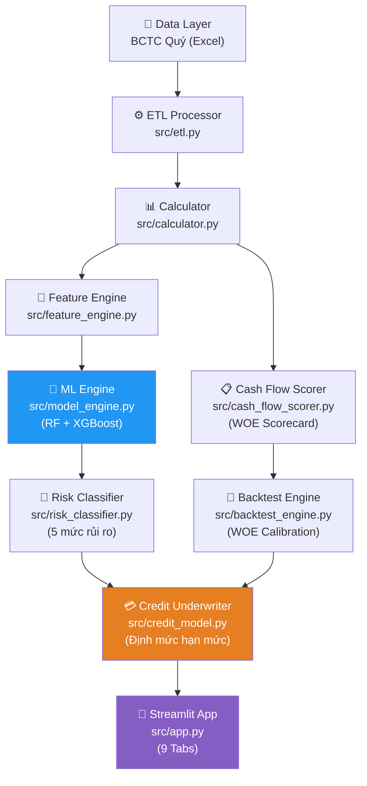
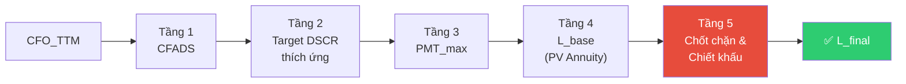

# TỔNG QUAN HỆ THỐNG & HƯỚNG DẪN TAB ĐỊNH VỊ HẠN MỨC TÍN DỤNG

> **Phiên bản tài liệu:** 2.0 — Cập nhật sau khi khắc phục lỗi vòng 1  
> **Phạm vi:** Kiến trúc tổng thể + Đặc tả kỹ thuật Tab Định mức Tín dụng  
> **Đối tượng:** Kỹ sư phát triển, Chuyên viên phân tích tín dụng

---

## PHẦN I — TỔNG QUAN KIẾN TRÚC HỆ THỐNG

### 1.1 Mục tiêu Chương trình

Hệ thống **Mô hình Đánh giá Phá sản (Bankruptcy Risk Assessment)** được thiết kế để:

1. **Phân tích rủi ro phá sản** của doanh nghiệp BĐS Việt Nam dựa trên BCTC quý
2. **Định mức tín dụng khả thi** (Credit Sizing) dựa trên dòng tiền thực tế, không phải tài sản thế chấp
3. **Chuẩn hóa** quy trình thẩm định rủi ro theo chuẩn Basel/IFRS 9 với bộ mô hình cổ điển và AI

### 1.2 Kiến trúc Pipeline



### 1.3 Sơ đồ Luồng Dữ liệu

| Bước | Module | Đầu vào | Đầu ra |
|------|--------|---------|--------|
| 1 | `ETLProcessor` | `.xlsx` quý (BS/IS/CF) | `annual_data`, `ttm_data` |
| 2 | `BankruptcyCalculator` | `annual_data`, `ttm_data` | Altman Z, Beneish M, Ohlson PD, DSCR... |
| 3 | `FeatureEngine` | `annual_data`, `calc_results` | Feature Matrix (50+ cột) |
| 4 | `MLEngine` | Feature Matrix | `PD_XGBoost` (xác suất phá sản) |
| 5 | `RiskClassifier` | Feature Matrix + calc_results | Risk Level 1–5, Composite Score |
| 6 | `CreditUnderwriter` | `CFO_TTM`, Risk Level, PD%, params | `L_final`, `Status`, `Schedule` |
| 7 | `BCTCCashFlowScorer` | `annual_data`, TTM | Cash Flow Score (0–100) |

### 1.4 Module Files — Tóm tắt Chức năng

| File | Dòng | Vai trò chính |
|------|------|--------------|
| [etl.py](file:///f:/mo_hinh_danh_gia_pha_san/phan_tich_pha_san_clone/src/etl.py) | ~350 | Parse XLSX, tổng hợp quarterly → annual, phát hiện năm partial |
| [calculator.py](file:///f:/mo_hinh_danh_gia_pha_san/phan_tich_pha_san_clone/src/calculator.py) | ~680 | Tính Altman, Beneish, Ohlson, Zmijewski, DSCR, Sloan, BĐS metrics |
| [feature_engine.py](file:///f:/mo_hinh_danh_gia_pha_san/phan_tich_pha_san_clone/src/feature_engine.py) | ~440 | Xây dựng feature matrix, expanding imputation, normalize |
| [model_engine.py](file:///f:/mo_hinh_danh_gia_pha_san/phan_tich_pha_san_clone/src/model_engine.py) | ~820 | RF feature selection + XGBoost PD, held-out test evaluation |
| [risk_classifier.py](file:///f:/mo_hinh_danh_gia_pha_san/phan_tich_pha_san_clone/src/risk_classifier.py) | ~367 | Composite Score → 5 mức rủi ro, Hard Rules BĐS |
| [credit_model.py](file:///f:/mo_hinh_danh_gia_pha_san/phan_tich_pha_san_clone/src/credit_model.py) | ~227 | Định mức hạn mức CFADS-based, Circuit Breakers, lịch trả nợ |
| [cash_flow_scorer.py](file:///f:/mo_hinh_danh_gia_pha_san/phan_tich_pha_san_clone/src/cash_flow_scorer.py) | ~420 | Scorecard 6 metrics WOE, expert + calibrated modes |
| [backtest_engine.py](file:///f:/mo_hinh_danh_gia_pha_san/phan_tich_pha_san_clone/src/backtest_engine.py) | ~310 | Labeling default (không circular), WOE Bayesian, LogReg calibration |
| [app.py](file:///f:/mo_hinh_danh_gia_pha_san/phan_tich_pha_san_clone/src/app.py) | ~1760 | Streamlit UI — 9 Tabs tích hợp toàn bộ pipeline |

---

## PHẦN II — ĐẶC TẢ KỸ THUẬT: TAB ĐỊNH VỊ HẠN MỨC TÍN DỤNG

### 2.1 Vị trí và Mục tiêu Tab

Tab **"Định mức Tín dụng"** (Tab 7 trong Streamlit Dashboard) là module **ra quyết định cuối cùng** của hệ thống — kết tinh toàn bộ output từ 6 tầng phân tích trước đó (ETL → Calculator → Feature → ML → Risk → Score) thành một con số hạn mức vay vốn cụ thể và lịch trả nợ thực tế.

> [!IMPORTANT]
> Tab này **không phải công cụ nhập tay** — toàn bộ đầu vào tài chính được tự động truy xuất từ BCTC của doanh nghiệp được chọn. Người dùng chỉ điều chỉnh **giả định vay vốn** (lãi suất, kỳ hạn).

### 2.2 Kiến trúc Tính toán — `CreditUnderwriter.calculate_capacity()`

Hàm tính toán trung tâm tại [credit_model.py L10–105](file:///f:/mo_hinh_danh_gia_pha_san/phan_tich_pha_san_clone/src/credit_model.py#L10-L105) hoạt động qua **5 tầng tuần tự**:



---

#### Tầng 1: CFADS — Dòng tiền Khả dụng Trả nợ

```
CFADS = max(CFO_TTM, 0)
```

| Điều kiện | Kết quả |
|-----------|---------|
| `CFO_TTM > 0` | CFADS = CFO_TTM — có thặng dư trả nợ |
| `CFO_TTM ≤ 0` | CFADS = 0 → **Circuit Breaker** → `L_final = 0` |

> [!CAUTION]
> CFO TTM được tính bằng tổng 4 quý gần nhất. Nếu dữ liệu chưa đủ 4 quý (partial year), ETL tự động annualize `× (4/num_quarters)` để tránh understate.

---

#### Tầng 2: Target DSCR Thích ứng

Hệ số an toàn dòng tiền nền là `1.20x`, được cộng dồn các khoản phạt rủi ro:

| Điều kiện Phạt | Delta DSCR | Lý do |
|---------------|-----------|-------|
| `Inventory/TA > 40%` | **+0.30** | Tồn kho BĐS bị kẹt pháp lý, dòng tiền trì hoãn |
| `Equity/Debt < 0.30` | **+0.30** | Đòn bẩy cao, bộ đệm vốn tự có mỏng |
| `WC/TA < 0` | **+0.20** | Vốn lưu động ròng âm, nguy cơ mất thanh khoản ngắn hạn |
| `PD_XGBoost > 0` | **+PD%/100** | AI Penalty tuyến tính theo xác suất phá sản |

**Ví dụ tính toán:**
```
Doanh nghiệp HQC (2023):
  Inventory/TA = 65% → +0.30
  Equity/Debt = 0.22  → +0.30
  WC/TA = -0.05       → +0.20
  PD_XGBoost = 42%    → +0.42
  ─────────────────────────────
  Target DSCR = 1.20 + 0.30 + 0.30 + 0.20 + 0.42 = 2.42x
```

---

#### Tầng 3: PMT_max — Số tiền Trả nợ Hàng năm Tối đa

```
PMT_max = CFADS / Target_DSCR
```

Đây là **giới hạn cứng** về tổng nghĩa vụ (gốc + lãi) tối đa mỗi năm mà doanh nghiệp có thể chịu đựng dựa trên dòng tiền thực tế.

---

#### Tầng 4: L_base — Hạn mức Cơ sở (Công thức Hiện giá Niên kim)

$$L_{base} = PMT_{max} \times \frac{1 - (1 + r)^{-n}}{r}$$

Trong đó:
- $r$ = Lãi suất vay hàng năm (tham số đầu vào từ user)
- $n$ = Kỳ hạn vay tính bằng năm (tham số đầu vào từ user)

| Lãi suất $r$ | Kỳ hạn $n$ | PV Factor |
|-------------|-----------|-----------|
| 8%/năm | 5 năm | 3.99 |
| 8%/năm | 10 năm | 6.71 |
| 12%/năm | 5 năm | 3.60 |
| 12%/năm | 10 năm | 5.65 |

---

#### Tầng 5: Chốt chặn & Chiết khấu — Circuit Breakers + Haircuts

Đây là **lưới an toàn kép**, thực thi theo thứ tự ưu tiên:

```
L_base
  │
  ├─[1] AI Circuit Breaker ─────── PD > 55% OR Risk Level ≥ 4?
  │         │ Yes → L_final = 0, Status = "Từ chối"
  │         │ No  ↓
  │
  ├─[2] ICR Breaker ─────────────── ICR < 1.0?
  │         │ Yes → L_final = 0, Status = "Từ chối"
  │         │ No  ↓
  │
  ├─[3] AI Haircut ──────────────── Risk Level 3 (Stress)?  → × 0.60
  │                                 Risk Level 2 (Watch)?   → × 0.85
  │                                 Risk Level 1 (Safe)?    → × 1.00
  │         ↓
  ├─[4] Equity Breaker ───────────── Equity ≤ 0?
  │         │ Yes → L_final = 0, Status = "Từ chối"
  │         │ No  ↓
  │
  └─[5] Leverage Cap ─────────────── L > (Equity/0.15 - TotalDebt)?
            │ Yes → L = min(L, LeverageCap)
            │ No  ↓
            
L_final ✅
```

**Chi tiết từng chốt chặn:**

| # | Tên | Điều kiện | Tác động | Lý do |
|---|-----|-----------|---------|-------|
| CB-1 | **AI Circuit Breaker** | `PD_XGBoost > 55%` hoặc `Risk_Level ≥ 4` | `L = 0`, Từ chối | Rủi ro phá sản quá ngưỡng kiểm soát |
| CB-2 | **ICR Breaker** | `ICR < 1.0` | `L = 0`, Từ chối | EBIT không đủ trả lãi vay hiện tại |
| CB-3 | **Equity Breaker** | `Equity ≤ 0` | `L = 0`, Từ chối | Mất vốn — phá sản kỹ thuật |
| CB-4 | **CFO Breaker** | `CFADS = 0` | `L = 0`, Từ chối | Không có thặng dư tiền mặt để trả nợ mới |
| H-1 | **AI Haircut Stress** | `Risk_Level = 3` | `L × 0.60` (-40%) | Bù đắp rủi ro Căng thẳng |
| H-2 | **AI Haircut Watch** | `Risk_Level = 2` | `L × 0.85` (-15%) | Bù đắp rủi ro Cảnh báo |
| L-1 | **Leverage Cap** | `L > E/0.15 - D` | `L = min(L, Cap)` | Bảo toàn tỷ lệ vốn tự có tối thiểu 15% |

### 2.3 Mối quan hệ với Risk Classifier

Tab Định mức phụ thuộc **trực tiếp** vào output của [risk_classifier.py](file:///f:/mo_hinh_danh_gia_pha_san/phan_tich_pha_san_clone/src/risk_classifier.py):

```
Risk Classifier → Risk_Level (1-5) + PD_XGBoost (%)
        ↓                    ↓
  AI Haircut (-15%/-40%)   AI DSCR Penalty (+PD/100)
  AI Circuit Breaker (≥4)  AI Circuit Breaker (>55%)
```

**Bảng ánh xạ Risk Level → Tác động Hạn mức:**

| Risk Level | Tên | DSCR Penalty | Haircut | Circuit Breaker |
|-----------|-----|-------------|---------|----------------|
| 1 — Safe 🟢 | An toàn | Chỉ theo PD% | Không | Không |
| 2 — Watch 🟡 | Cảnh báo | Chỉ theo PD% | **-15%** | Không |
| 3 — Stress 🟠 | Căng thẳng | Chỉ theo PD% | **-40%** | Không |
| 4 — Danger 🔴 | Nguy hiểm | — | — | **Từ chối** |
| 5 — Critical ⚫ | Nghiêm trọng | — | — | **Từ chối** |

### 2.4 Composite Score — Cơ chế Phân loại 5 Mức

`RiskClassifier.classify_single()` tính **Composite Score** theo công thức weighted average:

$$Composite = \sum_{i} w_i \times Signal_i$$

**Trọng số theo ngành:**

| Signal | Bán lẻ (RETAIL) | BĐS (REAL_ESTATE) | Mặc định |
|--------|----------------|-------------------|---------|
| `PD_XGBoost` | **40%** | **40%** | 35% |
| `PD_Ohlson` | 15% | 15% | 15% |
| `PD_Zmijewski` | 5% | 5% | 15% |
| `Altman Z` | **25%** | 20% | 20% |
| `Beneish M` | 10% | — | 10% |
| `Sloan Accruals` | — | **15%** | — |
| `DSCR` | 5% | 5% | 5% |

> [!NOTE]
> BĐS thay thế Beneish M-Score bằng Sloan Accruals vì Beneish tập trung vào DSRI (Doanh thu phải thu) — chỉ tiêu ít có ý nghĩa trong BĐS. Sloan phát hiện lợi nhuận ảo thông qua gap giữa Accruals và CFO.

**Ngưỡng phân loại composite (cố định theo thiết kế):**

| Composite Score | Risk Level |
|----------------|-----------|
| `< 15` | 🟢 1 — Safe |
| `15 – 35` | 🟡 2 — Watch |
| `35 – 55` | 🟠 3 — Stress |
| `55 – 75` | 🔴 4 — Danger |
| `≥ 75` | ⚫ 5 — Critical |

**Hard Override Rules** (nâng cấp cứng — không hạ cấp):

| Rule | Điều kiện | Tác động |
|------|-----------|---------|
| Rule 1 | `PD_XGBoost > 70%` | `level = max(level, 5)` — Critical tối thiểu |
| Rule 2 | `Z_Score < 1.1 AND PD > 40%` | `level = max(level, 4)` — Danger tối thiểu |
| Rule 3 | `M_Score > -2.22 AND PD > 20%` | `level = max(level, 3)` — Stress tối thiểu |
| BĐS-1 | CFO < 0 liên tục ≥2 năm AND ICR < 1 | `level = max(level, 4)` — Danger tối thiểu |
| BĐS-2 | `runway_interest < 1 quý` | `level = max(level, 5)` — Critical tối thiểu |

### 2.5 Lịch Trả nợ — `generate_repayment_schedule()`

Module [credit_model.py L128–190](file:///f:/mo_hinh_danh_gia_pha_san/phan_tich_pha_san_clone/src/credit_model.py#L128-L190) hỗ trợ 2 phương thức:

#### Phương thức 1: Niên kim Đều (Annuity — Equal Payment)

$$PMT = L \times \frac{r \times (1+r)^n}{(1+r)^n - 1}$$

- **Đặc điểm:** Số tiền trả mỗi năm cố định, lãi giảm dần, gốc tăng dần
- **Phù hợp:** DN rủi ro cao (Risk Level ≥ 3), DSCR thấp (<1.3x), BĐS dòng tiền không đều

#### Phương thức 2: Gốc Đều, Lãi Giảm Dần (Equal Principal)

$$\text{Gốc}/\text{năm} = L/n; \quad \text{Lãi}_t = B_t \times r$$

- **Đặc điểm:** Gốc cố định, lãi giảm dần, tổng lãi phải trả ít hơn Annuity
- **Phù hợp:** DN Safe/Watch, dòng tiền dồi dào, muốn giải phóng hạn mức nhanh

#### Đề xuất Phương thức Tự động (`recommend_repayment_method()`)

| Điều kiện | Đề xuất | Lý do |
|-----------|---------|-------|
| `Risk_Level ≥ 3` | **Annuity** | Tránh gánh nặng gốc đột biến gây mất khả năng thanh toán |
| `DSCR < 1.3x` | **Annuity** | Dòng tiền biên độ hẹp, cần dàn trải đều |
| `Safe/Watch + DSCR ≥ 1.3x` | **Equal Principal** | Tối thiểu chi phí lãi, giảm nhanh dư nợ |
| BĐS + `Inventory/TA > 40%` | **Annuity + Ân hạn 1-2 năm** | Chờ bàn giao dự án trước khi phát sinh gốc |

### 2.6 Phân tích Độ nhạy Lãi suất

`generate_sensitivity_curve()` tính lại `L_final` cho dải lãi suất `±10%` quanh mức hiện tại.

**Đường cong có hình dạng đặc trưng:**

```
L_final (Tỷ VND)
    │
 50 ┤        ●─────●
 40 ┤     ●           ●
 30 ┤  ●                 ●
  0 ┤─────────────────────────── Rate (%)
    6%   8%  10%  12%  14%
              ↑
         Lãi suất hiện tại
         (đường đứt nét đỏ)
```

**Điểm inflection** (nơi đường cong gãy xuống 0): là lãi suất tại đó `L_final` chạm vào `Leverage_Cap` hoặc khi `PMT_max × PV_Factor < Leverage_Cap`.

---

## PHẦN III — LUỒNG VẬN HÀNH TRÊN GIAO DIỆN

### 3.1 Đầu vào Người dùng

```
┌─────────────────────────────────────────────────┐
│  Tab 7: Định mức Tín dụng                        │
│  ─────────────────────────────────────────────   │
│  Chọn doanh nghiệp: [ANV ▼]                      │
│                                                   │
│  Giả định vay vốn:                                │
│  Lãi suất (%/năm): ─────●───── 10.0%             │
│                    1%          25%                │
│  Kỳ hạn vay (năm): ───────●── 5 năm              │
│                    1           20                 │
│                                                   │
│  [🔍 Tính Hạn mức]                               │
└─────────────────────────────────────────────────┘
```

**Dữ liệu tự động được truy xuất (không cần nhập tay):**

| Tham số | Nguồn | Ghi chú |
|---------|-------|---------|
| `CFO_TTM` | BCTC quý gần nhất | Tổng 4Q gần nhất, annualized nếu partial |
| `ICR` (Interest Coverage) | calculator.py DSCR module | EBIT / Chi phí lãi vay |
| `Inventory/TA` | BCTC Balance Sheet | Hàng tồn kho / Tổng tài sản |
| `Equity/Debt` | BCTC Balance Sheet | Vốn chủ sở hữu / Tổng nợ |
| `WC/TA` | BCTC Balance Sheet | (Tài sản ngắn hạn − Nợ ngắn hạn) / TS |
| `Equity` | BCTC Balance Sheet | Vốn chủ sở hữu cuối kỳ |
| `Total_Debt` | BCTC Balance Sheet | Nợ vay tài chính ngắn + dài hạn |
| `PD_XGBoost` | MLEngine output | % xác suất phá sản |
| `Risk_Level` | RiskClassifier output | 1–5 |

### 3.2 Bộ chỉ số Kết quả (KPI Cards)

| KPI | Ý nghĩa | Ngưỡng tốt |
|-----|---------|-----------|
| **Target DSCR** | Hệ số an toàn dòng tiền sau điều chỉnh rủi ro | ≤ 1.8x |
| **PMT_max/năm** | Số tiền gốc + lãi tối đa có thể trả/năm | — |
| **L_base** | Hạn mức cơ sở trước các chốt chặn | — |
| **L_final** | **Hạn mức khả thi cuối cùng** | > 0 |
| **AI Impact** | Chiết khấu do AI: Không / -15% / -40% / Từ chối | Không |
| **Status** | Khả thi / Cắt giảm / Từ chối | Khả thi |

**Màu sắc Status:**
- 🟢 **Xanh** — Khả thi: đủ điều kiện toàn bộ
- 🟠 **Cam** — Cắt giảm: có haircut hoặc leverage cap
- 🔴 **Đỏ** — Từ chối: `L_final = 0`, không cấp tín dụng mới

### 3.3 Cảnh báo Tự động

Hệ thống sinh danh sách `warnings` giải thích chi tiết từng lý do cắt giảm hoặc từ chối:

```
⚠️ AI Circuit Breaker: Từ chối do rủi ro phá sản nghiêm trọng
   (PD: 62.3%, Risk Level: 4).

⚠️ Chốt chặn đòn bẩy: Giới hạn dư nợ mới không vượt quá 125.0 Tỷ VND.

⚠️ AI Haircut: Cắt giảm 40% hạn mức do thuộc nhóm rủi ro Căng thẳng (Stress).
```

---

## PHẦN IV — KIỂM SOÁT CHẤT LƯỢNG SAU CẬP NHẬT

### 4.1 Những thay đổi đã áp dụng (v2.0)

| # | Thay đổi | File | Tác động |
|---|---------|------|---------|
| F1 | **Loại PD_XGBoost khỏi `_label_default`** | backtest_engine.py | Phá vỡ circular labeling, nhãn Default giờ pure financial |
| F2 | **Partial year annualization** | etl.py | IS/CF không còn bị understate khi năm chưa đủ 4 quý |
| F3 | **Min 2 năm validation** | feature_engine.py | Warning rõ ràng, không silent NaN |
| F4 | **CFO growth fallback = NaN** | cash_flow_scorer.py | Không còn bias +5 điểm khi thiếu dữ liệu |
| F5 | **Expanding median imputation** | feature_engine.py | Loại bỏ data leakage từ dữ liệu tương lai |
| F6 | **WOE Bayesian smoothing** | backtest_engine.py | WOE ổn định khi n_bad nhỏ |
| F7 | **Stratified split + threshold tuning** | backtest_engine.py | Optimal threshold thay vì mặc định 0.5 |
| F8 | **Held-out test set (20%)** | model_engine.py | Metrics ROC/PR-AUC không bị inflate |
| F9 | **UserWarning expert mode** | cash_flow_scorer.py | Cảnh báo khi dùng điểm chưa calibrate |

### 4.2 Những quyết định thiết kế được giữ nguyên

| Quyết định | Lý do |
|-----------|-------|
| Bins config hardcoded | Intentional — demo phase, sẽ chuyển optimal binning trong MVP |
| Ngưỡng composite 15/35/55/75 | Xác thực theo ngưỡng thiết kế, chưa thay đổi |
| Synthetic data phân phối Gaussian | Chấp nhận tạm thời — model cần chạy được trước khi có đủ dữ liệu thực |
| Ngưỡng Altman Z<1.1, Beneish M>-2.22 | Q1-A: Giữ ngưỡng gốc, thêm documentation |

### 4.3 Kết quả Kiểm thử (test_fixes.py)

```
19/19 tests PASS ✅

T1: ETL partial year annualization ............. 4/4 PASS
T2: Feature Engine min 2 năm warning ........... 3/3 PASS
T3: Cash Flow Scorer CFO fallback .............. 2/2 PASS
T4: Backtest circular labeling ................. 2/2 PASS
T5: WOE stability (no NaN/Inf) ................. 2/2 PASS
T6: Model Engine held-out test ................. 3/3 PASS
T7: Expanding median imputation ................ 3/3 PASS
```

---

## PHẦN V — HƯỚNG DẪN CHẠY HỆ THỐNG

### 5.1 Quy trình Khởi động

```bash
# Bước 1: Cài dependencies
pip install -r requirements.txt

# Bước 2: Retrain model với dữ liệu đầy đủ (Ba Lan + Đài Loan)
python run_retrain_full.py

# Bước 3: Chạy backtest calibration (WOE + LogReg)
python run_backtest.py

# Bước 4: Chạy kiểm thử tự động
python test_fixes.py

# Bước 5: Khởi chạy Dashboard
streamlit run src/app.py
```

### 5.2 File Cấu hình Tự động Sinh

| File | Sinh bởi | Dùng bởi |
|------|---------|---------|
| `optimized_scorecard_config.json` | `run_backtest.py` | `BCTCCashFlowScorer` |
| `xgboost_model.pkl` | `run_retrain_full.py` | `MLEngine.predict()` |
| `scaler.pkl` | `run_retrain_full.py` | `MLEngine.predict()` |
| `selected_features.json` | `run_retrain_full.py` | `MLEngine.predict()` |

### 5.3 Dữ liệu đầu vào

Mỗi doanh nghiệp cần file `.xlsx` tại `data/companies/<TICKER>.xlsx` với **3 sheet bắt buộc**:

| Sheet | Nội dung | Yêu cầu tối thiểu |
|-------|---------|------------------|
| `BALANCE_SHEET` | Bảng cân đối kế toán | ≥ 2 năm BS (Q4 mỗi năm) |
| `INCOME_STATEMENT` | Kết quả kinh doanh | ≥ 2 năm IS |
| `CASH_FLOW` | Lưu chuyển tiền tệ | ≥ 2 năm CF (cho CFO growth) |

> [!WARNING]
> Nếu chỉ có 1 năm dữ liệu: hệ thống sẽ phát `UserWarning` và tính các features đơn năm (Altman, Zmijewski). Các features cần ≥2 năm (revenue_growth, Beneish, Sloan, CFO_growth) sẽ là NaN và không tính điểm.

---

## PHẦN VI — THUẬT NGỮ VÀ CÔNG THỨC THAM CHIẾU

| Thuật ngữ | Định nghĩa | Công thức |
|-----------|-----------|----------|
| **CFADS** | Cash Flow Available for Debt Service | `max(CFO_TTM, 0)` |
| **DSCR** | Debt Service Coverage Ratio | `CFADS / (P + I)` |
| **ICR** | Interest Coverage Ratio | `EBIT / Interest_Expense` |
| **PMT_max** | Maximum Annual Debt Service | `CFADS / Target_DSCR` |
| **L_base** | Base Loan Amount (PV of Annuity) | `PMT × [(1-(1+r)^-n)/r]` |
| **L_final** | Final Credit Limit after all adjustments | `L_base` sau chốt chặn |
| **Leverage_Cap** | Maximum new debt from balance sheet | `max(0, E/0.15 - D)` |
| **PD_XGBoost** | Probability of Default (XGBoost model) | 0–100% |
| **Composite_Score** | Weighted risk signal aggregation | Σ(w_i × signal_i) |
| **WOE** | Weight of Evidence | `ln(Dist_Good / Dist_Bad)` |
| **Haircut** | Credit limit reduction multiplier | Risk Level → ×0.60 or ×0.85 |

---

*Tài liệu hướng dẫn toàn diện — Mô hình Đánh giá Phá sản & Tab Định vị Hạn mức Tín dụng*  
*Cập nhật: 2026-05-21 — Phiên bản 2.0 sau khắc phục 9 lỗi vòng 1*
